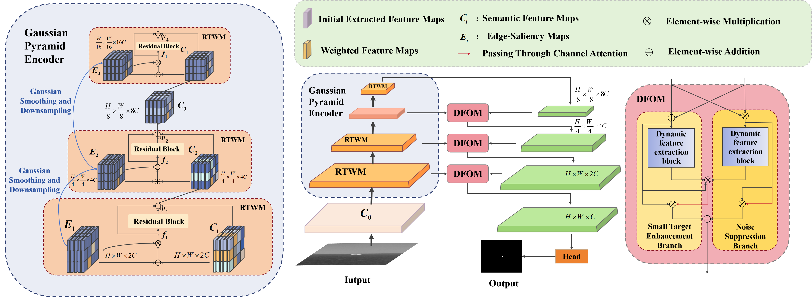

# DRTENet: Dual-Focus Residual Tensor Enhancement Network for Infrared Small Target Detection


## Abstract
Moving infrared small target detection presents significant challenges due to tiny target sizes and low contrast against backgrounds. Currently-existing methods primarily focus on extracting target features only from the spatial-temporal domain. For further enhancing feature representation, more information domains such as frequency are believed to be potentially valuable.  To extend target feature learning, we propose a new Triple-domain Strategy (Tridos) with the frequency-aware memory enhancement on the spatial-temporal domain. In our scheme, it effectively detaches and enhances frequency features by a local-global frequency-aware module with Fourier transform. Inspired by the human visual system, our memory enhancement aims to capture the target spatial relations between video frames. Furthermore, it encodes temporal dynamics motion features via differential learning and residual enhancing.
Additionally, we further design a residual compensation unit to reconcile possible cross-domain feature mismatches.
To our best knowledge, our Tridos is the first work to explore target feature learning comprehensively in spatial-temporal-frequency domains. The extensive experiments on three datasets (DAUB, ITSDT-15K, and IRDST) validate that our triple-domain learning scheme could be obviously superior to state-of-the-art ones.

## Prerequisite
- python == 3.8
- pytorch == 1.10
- CUDA == 11.1
- mmcv-full == 1.7.0
- mmdet == 2.25.0
- mmsegmentation == 0.28.0

## Datasets
- You can download them directly from the website: [NUAA](https://www.scidb.cn/en/detail?dataSetId=720626420933459968), [IRSDT](https://www.scidb.cn/en/detail?dataSetId=de971a1898774dc5921b68793817916e&dataSetType=journal), [NUDT](https://xzbai.buaa.edu.cn/datasets.html).

## Usage
### Train
```
CUDA_VISIBLE_DEVICES=0 python train.py
```
### Test
- Usually model_best.pth is not necessarily the best model. The best model may have a lower val_loss or a higher AP50 during verification.
```
CUDA_VISIBLE_DEVICES=0 python vid_map_coco.py
```
### Visulization
```
python vid_predict.py
```

## Citation
If you find this repo useful, please cite our paper.
```


```
